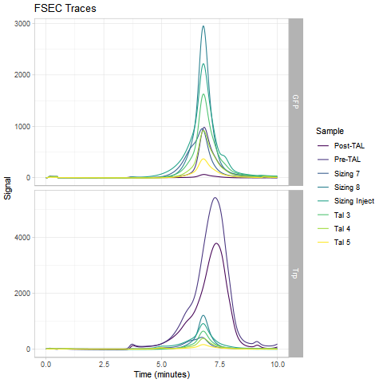

# Waters HPLC Processing Scripts
This is a collection of scripts for quick analysis and plotting
of Waters liquid chromatography data. I expect that you'll run the
batch file from the same directory as the python and R scripts, as
well as your raw data (which are .arw files).

## How to format your Waters export method
I have dropped support for Waters data exported with long headers (i.e., two
columns and multiple rows). These scripts now require your data to be formatted
with a single pair of rows, with the columns deliniating what header goes where.

The 2D script requires `SampleName`, `Channel`, and `Sample Set Name`. The
3D script requires `SampleName`, `Instrument Method Name`, and `Sample Set Name`.
The order is not important, so long as the required headers are present in the .arw
file. Other information can be there as well, it won't hurt anything.

## What the scripts do
`export_script.bat` simply runs `assemble_traces.py`, which does all the
heavy lifting. This is to get around the fact that you can't make python scripts
executable in Windows.

`assemble_traces.py` first moves all of the 'arw' files into a new directory,
where it reads them and creates two files: `long_chromatograms.csv` and `wide_chromatograms.csv`.
It then adds this experiment to the couchdb database using your config file. `config.py`
needs to be in the same directory as `backend.py` and have the username and password
for the database in a dictionary. Finally, it runs `auto_graph.R` on `long_chromatograms.csv`.

 * `--quiet` will prevent messages from printing to terminal.
 * `--no-db` is for use if you don't have couchdb and don't want to use the web interface.
 * `--no-plots` will not run the R script, just generate the csvs and add them to the db.
 * `--copy-manual` copies over the R script to the out dir so you can fine-tune the plot yourself.

`auto_graph.R` produces the graphs. It produces a raw and normalized trace
for each channel, colored by sample.



The 3D scripts will automatically determine if your samle was run with an excitation
or emission scan, separate the data into two groups, and plot each group independently.
This all relies on your instrument method containing _exactly one_ instance of the
pattern (without braces) `Scan{Ex|Em}{###}` where Ex or Em stands for excitation or
emission scan, and ### is the constant wavelength. So for example, if you
were scanning the emission while holding excitation constant at 540nm, your
instrument method needs the pattern `ScanEm540`.


## Web UI
The new Web UI relies on a couchdb database running on your HPLC computer.
`app.py` is a plotly dash script that creates
a web interface where you can go through and find traces by typing in a dropdown and
interact with them directly. This is much faster than the old R solution, because
it doesn't have to re-draw graphs every time you change anything and it is reading
from a database instead of a file. Make sure you've got `config.py` with your
couchdb username and password in a dictionary. For example:
```
config = {'user': (username), 'password': (password)}
```
You will also want to serve this app somehow. `waitress.py` is one answer.
