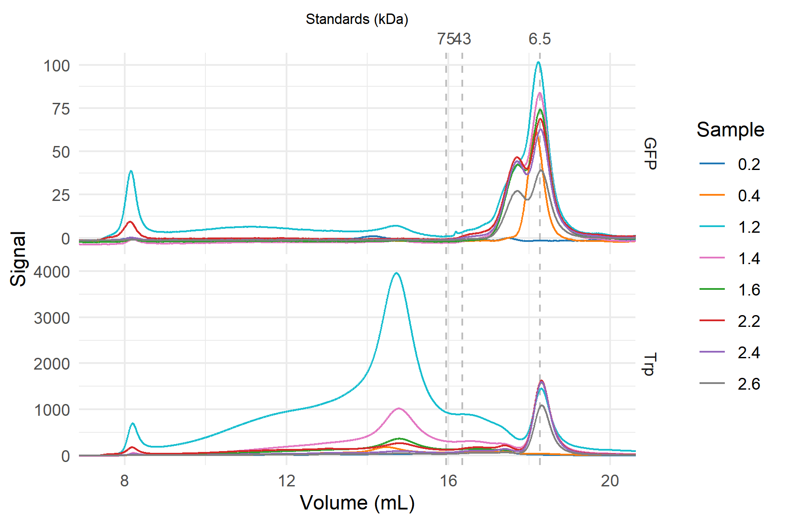

# Appia - simple chromatography processing
Appia is a set of scripts to process chromatography data from AKTA, Shimadzu, and
Waters systems. HPLC data can then be viewed on the easy-to-use and intuitive
web interface, built with plotly dash.

Additionally, automatic plots will be prepared for all three types of chromatography
data using ggplot in R. Options to copy a manual file for plot tweaking are
available.

## Installation
### Server installation
1. Install docker
2. Create a docker-compose file from the template (change the username and password!)
3. Create an appia `config.py` from `subcommands/example_config.pyt`
4. Set the host in `subcommands/config.py` to `couchdb` and update the username
and password
5. Run `docker-compose up`

### Local/processing-only installation:
1. Clone this repo
2. Run `python3 -m virtualenv venv`
3. Run `venv/Scripts/activate` or `source venv/Scripts/activate`
4. Run `python -m pip install -r requirements.txt`
5. Create the file `subcommands/config.py` (see `example_config.py` for help) and
add the host/username/password for your server's couchdb installation (if using).

## HPLC Processing
Appia reads `.arw` or `.asc` files (from Waters and Shimadzu HPLCs, respectively)
for information about the sample and how it was run, then optionally collects all the indicated
traces into an Experiment for upload to the visualization database.

### How to format your Waters export method
When exporting your data, please export the headers as two rows with multiple columns,
rather than two columns with multiple rows.

The 2D script requires `SampleName`, `Channel`, `Instrument Method Name` and
`Sample Set Name`. The 3D script requires `SampleName`, `Instrument Method
Name`, and `Sample Set Name`. The order is not important, so long as the
required headers are present in the .arw file. Other information can be there as
well, it won't hurt anything. You will also want to update the flow rates to
match your per-column flow rate. Your `Instrument Method` must contain either
`5_150` or `10_300` (for 5/150 and 10/300) columns. You can, of course, use what
I call the `flow_rates` dict in `assemble_hplc.py` to read the Instrument method
for whatever you like.

If you are using a Shimadzu instrument, you've got a little less support than Waters.
Your method will need the standard headers, including `Sample ID:`, `Total Data Points`, and
`Sampling Rate:`. Additionally, I have the script configured to assume two detectors.
You will need to change the `channel_names` list as you see fit in `assemble_hplc.py`.

Example default HPLC plot

### Automated Processing
By adding an export method to the end of your Waters chromatography run, the data
processing can be automated. In the export method, set a report PDF to save to
a specified file and the data to save to another file. The PDF contents are not
important; they are used so that the FileSystemWatcher can tell that a run is over.

Launch the result_monitor.ps1 script, with the paths modified appropriately. When
a PDF gets saved to the reports directory, depending on the name of the PDF file,
the HPLC script is run in the appropriate result directory.

### 3D Processing
The 3D scripts will automatically determine if your samle was run with an excitation
or emission scan, separate the data into two groups, and plot each group independently.
This all relies on your instrument method containing _exactly one_ instance of the
pattern (without braces) `Scan{Ex|Em}{###}` where Ex or Em stands for excitation or
emission scan, and ### is the constant wavelength. So for example, if you
were scanning the emission while holding excitation constant at 540nm, your
instrument method needs the pattern `ScanEm540`.

## AKTA FPLC Processing
The AKTA processing is straightforward. First, export your data from the AKTA in
.csv format. Then, run `appia.py fplc` on either one .csv file or a list of
.csv files. There are options for mass-processing several experiments at once.
Single FPLC csvs can be made into an experiment and uploaded to the web interface.

## Web UI

Much of my recent work on this project is centered around the Web UI. When you
process HPLC and FPLC data with Appia, you create an Experiment. These experiments
contain methods of displaying the data, along with the data themselves. Appia uploads
them to a CouchDB server (see `subcommands/example_config.pyt` to configure your
Appia install with your server). Then you can run the plotly dash app `web_ui.py`
to display that data.

### Uploading an Experiment
Both the HPLC and FPLC scripts automatically upload the resulting Experiment to
the server. If you want to pair experiments (that is, have FPLC and HPLC data
shown on the same page) simply upload HPLC and FPLC experiments with the same name,
or use `appia combined` for simultaneous processing. You can always update an existing
experiment (or add to one) by processing data and giving the same experiment name.

### Viewing the experiment
Simply navigate to your server and visit `www.myserver.com/traces`. You can search
experiments in the dropdown menu and concatenate HPLC results to compare across
experiments.

## Batch scripts
From the command line, the best way to use Appia is to run appia.py. However,
several batch scripts are included in this repo to give users who prefer not
to use command line interfaces a set of commonly-used optoins.

 * `hplc_export` runs `appia.py hplc .`, with all default options
 * `hplc_rename_export` runs `appia.py hplc --rename [user-input] .`, to rename
or combine experiments in the web interface.
 * `hplc_LSE_export` runs `appia.py hplc --reduce 10 --no-plots --rename [user-input] .`,
which is useful if a great number of traces are being combined
for viewing through the web interface.
 * `3D-hplc_export` runs `appia.py three-d .`, for analysis of three dimensional
HPLC experiments.
