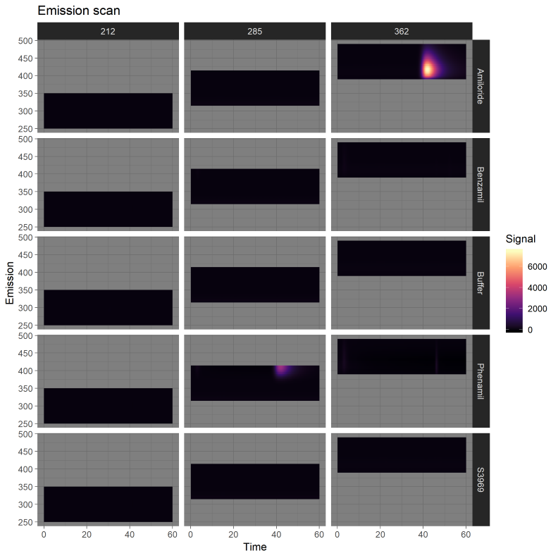

# Appia - simple chromatography processing
Appia is a simple set of scripts to process chromatography data from AKTA and
Waters systems. HPLC data can then be viewed on the easy-to-use and intuitive
web interface, built with plotly dash and hosted locally for data security.

Additionally, automatic plots will be prepared for all three types of chromatography
data using ggplot in R. Options to copy a manual file for plot tweaking are
available.

## Waters HPLC Processing
This is a collection of scripts for quick analysis and plotting
of Waters liquid chromatography data. I expect that you'll run the
batch file from the same directory as the python and R scripts, as
well as your raw data (which are .arw files).

### How to format your Waters export method
I have dropped support for Waters data exported with long headers (i.e., two
columns and multiple rows). These scripts now require your data to be formatted
with a single pair of rows, with the columns deliniating what header goes where.

The 2D script requires `SampleName`, `Channel`, and `Sample Set Name`. The
3D script requires `SampleName`, `Instrument Method Name`, and `Sample Set Name`.
The order is not important, so long as the required headers are present in the .arw
file. Other information can be there as well, it won't hurt anything.


The 3D scripts will automatically determine if your samle was run with an excitation
or emission scan, separate the data into two groups, and plot each group independently.
This all relies on your instrument method containing _exactly one_ instance of the
pattern (without braces) `Scan{Ex|Em}{###}` where Ex or Em stands for excitation or
emission scan, and ### is the constant wavelength. So for example, if you
were scanning the emission while holding excitation constant at 540nm, your
instrument method needs the pattern `ScanEm540`.



## Shimadzu HPLC Processing
Shimadzu exports are also supported. Simply run the script as normal on `.asc` files
exported from the instrument, and add the `--shimadzu` flag. The code for shimadzu
is a secondary priority, so some hardcoding may be required if you don't have the
same number of detectors as we do.

## Web UI


The Web UI relies on a couchdb database running on your HPLC computer.
`app.py` is a plotly dash script that creates
a web interface where you can go through and find traces by typing in a dropdown and
interact with them directly. This is much faster than the old R solution, because
it doesn't have to re-draw graphs every time you change anything and it is reading
from a database instead of a file. Make sure you've got `config.py` with your
couchdb username and password in a dictionary. For example:
```
config = {'user': (username), 'password': (password)}
```
You will also want to serve this app somehow. `waitress.py` is one answer.

### Batch scripts
From the command line, the best way to use Appia is to run appia.py. However,
several batch scripts are included in this repo to give users who prefer not
to use command line interfaces a set of commonly-used optoins.

 * `hplc_export` runs `appia.py hplc .`, with all default options
 * `hplc_rename_export` runs `appia.py hplc --rename [user-input] .`, to rename
or combine experiments in the web interface.
 * `hplc_LSE_export` runs `appia.py hplc --reduce 10 --no-plots --rename [user-input] .`,
which is useful if a great number of traces are being combined
for viewing through the web interface.
 * `3D-hplc_export` runs `appia.py three-d .`, for analysis of three dimensional
HPLC experiments.

## AKTA FPLC Processing
The AKTA processing is straightforward. First, export your data from the AKTA in
.csv format. Then, run `appia.py fplc` on either one .csv file or a list of
.csv files. There are options for mass-processing several experiments at once.
