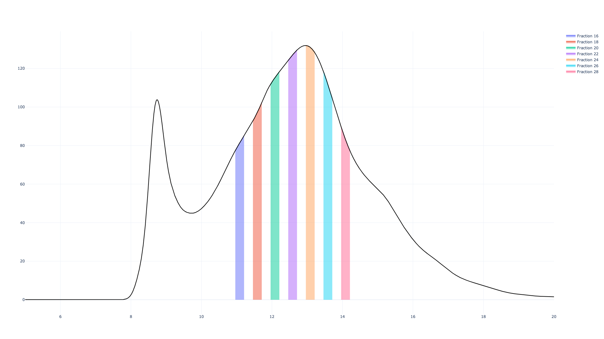

[](https://zenodo.org/badge/latestdoi/160436725)

# Appia - simple chromatography processing
Appia is a set of scripts to process and view chromatography data from AKTA, Shimadzu, and
Waters systems. Chromatography data can then be viewed on the easy-to-use and intuitive
web interface, built with [plotly dash](https://plotly.com/dash/). Please check out the
[web demo](https://traces.baconguislab.com/)!

If you find Appia useful in your research, please [cite it](https://dx.doi.org/10.1371/journal.pone.0280255).

## Installation 👷
### Server installation 
1. Install [docker](https://www.docker.com/)
2. Copy `docker-compose.yml` wherever you want the database to save data
3. Set the $COUCHDB_USER and $COUCHDB_PASSWORD environment variables (**in your environment!**)
4. Run `docker-compose up` in the same directory as docker-compose.yml
5. Open the port from `docker-compose.yml` to allow other instruments to access the web ui
6. *(Optional) Instead of opening the port, put Appia behind a reverse proxy server with authentication*

Once you've installed Appia Web, you can access it directly
by opening ports 8080 (for Appia Web) and 5984 (for the database)
and accessing it at `{server name}:8080/traces`.
However, we recommend you host it behind [NGINX](https://www.nginx.com/), both to remove
the requirement of specifying a port, and to add the ability
to control access to your Appia database. Here is an example
config for NGINX:

```
location /traces/ {
    proxy_set_header HOST $http_host;
    proxy_pass http://{server name}:8080/traces/;
}
```

This way, your users can access the server directly at
`{server name}/traces`, and you can add a password using
[the standard methods](https://docs.nginx.com/nginx/admin-guide/security-controls/configuring-http-basic-authentication/).
If using NGINX, you no longer need to open port 8080. You do
still need to open port 5984 for the database.

### Local/processing-only installation:
This process will install Python and all the packages/libraries you need.
I highly recommend you use a virtual environment for the python packages. Conda
is also fine, but I'm trying to keep this as simple as possible. If you want
to use ggplot to make manually-tweaked plots, you should also follow the steps
to install R and RStudio.

1. Install [python3](https://www.python.org/) 
    1. *(Recommended)* Run `python -m virtualenv venv` 
    2. *(Recommended)* Run `venv/Scripts/activate` (Windows) or `source venv/bin/activate` (Mac/Linux)
2. Run `python -m pip install appia` (`python3` for linux)
3. *(If using Appia Web)* set up database access using `appia utils --database-setup`.

After performing these steps, Appia is ready to process your data! Detailed information about
processing supported instruments is given below, but if you want to jump right in, you can
either use the included batch scripts, or run `appia process {filenames}` to start processing!

### Updating Appia

To update Appia Web, open a terminal/powershell window and run the following
commands in the Appia Web directory:

```
docker-compose pull
docker-compose down
docker-compose up -d --remove-orphans
```

This will download the latest docker image and start it up on your server.

To update the Appia processing scripts, simply run `python3 -m pip install --upgrade appia` in any terminal window.

## Analytic Chromatography Processing 📈

Appia can currently process the following HPLC data files:

| Manufacturer | Expected File Format       |
| ------------ | -------------------------- |
| Waters       | `.arw`                     |
| Shimadzu     | `.asc` (old), `.txt` (new) |
| Agilent      | `.csv`                     |


*Please note that our lab uses Waters instruments*. Others are supported, but
we will need more information from you for non-Waters bug reports and
feature requests!

### Flow Rates
To be able to convert between retention volume and time, Appia needs flow rates.
You can provide these in a few ways.

1. (Recommended) Use `appia utils --flow-rate` to add a method name and a flow
rate. You can add just a part of the method name. For example, `appia utils
--flow-rate 10_300 0.5` will create a flow rate entry which would match
methods like `Sup6_10_300_PumpA` and `10_300_FLR-GFP` but not `5_150_ChA`.
Multiple matches will force you to manually enter, so don't make them
too broad. These settings are stored at `~/.appia-settings.json`.
2. Provide a flow rate during processing. This will set *all* HPLC flow rates
for this processing batch.
3. Provide flow rates for each file manually. If you did not use one of the
above methods, Appia will prompt you individually for each file.

### Waters Export Method
When exporting your data, please export the headers as two rows with multiple columns,
rather than two columns with multiple rows.

The Waters script requires `SampleName`, `Channel`, `Instrument Method Name` and
`Sample Set Name`. The order is not important, so long as the
required headers are present in the .arw file. Other information can be there as
well, it won't hurt anything. Flow rate information is pulled from
`processors/flow_rates.json`. If your Instrument Method contains *exactly one* key
from that JSON file, the flow rate is set accordingly. If the file does not exist,
or if your Method matches more or fewer than one key, you will be asked to fill
provide a flow rate. They can also be provided using the `--hplc-flow-rate`
argument.

### Shimadzu Data Export

**Older Instruments**

If you are using an old Shimadzu instrument, your method will need the
standard headers, including `Sample ID`, `Total Data Points`, and `Sampling Rate`. When you process, you will need
to pass a set of arguments to tell Appia which channel corresponds to what,
since Shimadzu instruments only output a letter. Additionally, you will be prompted
for a flow rate (or you can provide one with `--hplc-flow-rate`).

**New Instruments**

Newer Shimadzu instruments output much more information about samples, which is great.
Manual input of flow rate is still necessary, and if you have more than one sample
with the same Sample Name *and* Sample ID being processed at the same time, they will
conflict. This should not happen unless you're combining samples from different runs
into a single processing event, which I consider a rare event. If this is essential
for your workflow please submit an [issue](https://github.com/PlethoraChutney/Appia/issues).

### Agilent Data Export

Unfortunately, Agilent has rather limited support for data export. Versions of OpenLab
prior to 2.4 lack the ability to export data in a format that Appia can read. However,
OpenLab 2.4 [introduced the ability to export data as a csv](https://community.agilent.com/technical/software/f/forum/1297/saving-dx-in-csv-excel-format).

Following those instructions
should yield a CSV with two unnamed columns, one representing retention time and the other
signal. Given this lack of information, other data has to be provided by the user. If your
file includes the pattern `Channel<###>` (where <###> is replaced by exactly
three digits), Appia will set the channel for that file to the provided number. If your
file includes the pattern `Flow<##.##>` (where <##.##> is replaced by any number of digits
and a period followed by any number of digits, e.g., 1.25) Appia will set the flow
rate for that file to that number, in mL/min. Otherwise, the user will be prompted for this
information at the command line.

We do not have access to an Agilent instrument, and we welcome collaboration on this front!

## Preparative Chromatography Processing 🧪
Currently, only GE/Cytiva AKTA preparative instruments are supported.
If you have a different manufacturer, or if your AKTA files do not work
with Appia, **please** open an issue so we can add more support!

The AKTA processing is straightforward. First, export your data from the AKTA in
.csv format. You'll have to open the trace in Unicorn and use the export button there,
just using "Export Data" saves a zipped binary which Appia can't read. Everything is
handled automatically, but there are several arguments for producing and customizing
automatic plots, if desired.

## Web UI

When you
process HPLC and/or FPLC data with Appia, you create an Experiment. These Experiments
are then uploaded to a CouchDB server. The Appia web server pulls data from the
CouchDB to display traces using plotly dash. This is the main power of Appia --- you
can use your browser to quickly see your data, zoom in and out, select different
traces, combine experiments to compare different runs, re-normalize the data, and
share links with lab members.

### Uploading an Experiment
To upload an experiment, when you process it include the `-d` flag. This will
attempt to read the environment variables `$COUCHDB_USER`, `$COUCHDB_PASSWORD`,
and `$COUCHDB_HOST` and use those to upload the Experiment to the correct database.
You can also pass a JSON file to `-d` instead (but you should never save passwords
in plaintext).

### Viewing the experiment
Simply navigate to your server and view the trace page. The docker default is
`{myserver}:8080/traces`. You can search
experiments in the dropdown menu and concatenate HPLC results to compare across
experiments. Clicking "Renormalize HPLC" will re-normalize the traces to set the
maximum of the currently-viewed unnormalized region to 1, allowing you to compare
specific peaks.

## Batch scripts
From the command line, the best way to use Appia is to run appia.py. However,
several batch scripts are included in this repo to give users who prefer not
to use command line interfaces a set of commonly-used options. You could write
equivalent shell scripts for Linux or Mac machines, but since most chromatography
systems run on Windows I've included these for those machines.

### process.bat
Read all files in the current directory and process all CSV, ASC, and ARW files
into a new experiment which is uploaded to the database using environment variables

### process-and-rename.bat
Same as above, but specify an Experiment ID yourself instead of reading one from
the data.

## Manual plot fine-tuning
For final publication plots, we typically fine-tune the appearance of the plot
using [ggplot2](https://ggplot2.tidyverse.org/). To this end, we include some
R scripts as suggested starting points for building publication plots. These manual
plotting scripts can be copied into the processed data directory using the
`--copy-manual` argument during processing. As you develop your own style, you
can save your own templates (still named `manual_plot_HPLC.R` and `manual_plot_FPLC.R`)
and pass the directory containing these templates to the `--copy-manual` argument.
You can, of course, use any plotting software you wish since the data is output
in both wide and long format.

# Example Data
Examples of correctly-formatted Waters, Shimadzu, and AKTA files can be found in `/test-files/`. The directory `/processed-tests/` is the result of the command:

```python appia.py -v process test-files/*.arw .\test-files\2018_0821SEC_detergentENaC.csv -kpo processed-tests -m 5 20 -f 16 28 2```

I included the -k parameter because I want to keep the raw files there, but if I
had not, they'd be moved to their own respective directories in
`/processed-tests/`. You'll see that in `/processed-tests/` there are three
files representing the compiled data, as well as auto-generated plots.

## HPLC Data


For ease of use, HPLC data is stored in both a long and wide format.

### Long format
mL is calculated from Time during processing. Sample and Channel are self-explanatory.
Normalization tells if Value is the raw signal or a normalized Signal from 0 to 1,
0 being the minimum and 1 being the maximum over that sample/channel combination,
unless a specific range over which to normalize was passed into Appia during processing.

| mL | Sample   | Channel | Time | Normalization | Value |
|----|----------|---------|------|---------------|-------|
| 0  | 05_25_BB | GFP     | 0    | Signal        | -1    |
| 0  | 05_25_BB | Trp     | 0    | Signal        | -35   |
| 0  | 05_25_D  | GFP     | 0    | Signal        | 3     |
| 0  | 05_25_D  | Trp     | 0    | Signal        | 0     |

### Wide format
Wide format is the same data, but presented in a more traditional, "excel-style" format.
Each column represents a trace, with a single column for Time to go along with it. You
may note that the example wide table has a strange format, with many empty rows. This is
because Shimadzu and Waters sample at different rates, meaning they do not have overlapping
sampling points for the most part. Appia handles this, by using a single Time column
and introducing empty rows in the Signal columns. Your plotting software should be able
to deal with that, or you can just filter for non-empty rows.

| Time     | 05_25_BB GFP | 05_25_BB Trp | 05_25_D GFP | 05_25_D Trp |
|----------|--------------|--------------|-------------|-------------|
| 0        | -1           | -35          | 3           | 0           |
| 0.033333 | -1           | -20          | 0           | -1          |

## FPLC data



FPLC data is only stored in long format since, by and large, it is the same as
what wide format would be. You just need to filter out channels you don't care about
to reproduce what a wide-format table would be. Interestingly, AKTAs sample each channel
at different rates, meaning that each channel has different x-axis values. This is all
handled correctly by Appia, but that would introduce blank rows in the wide table, as
with the HPLC example data. The fraction column indicates the vial into which that
data point was dumped. This is used to fill fractions of interest, as seen in the
example FPLC plot and the web interface.

| mL       | CV       | Channel | Fraction | Sample                     | Normalization | Value    |
|----------|----------|---------|----------|----------------------------|---------------|----------|
| -0.00701 | -0.00029 | mAU     | 1        | 2018_0821SEC_detergentENaC | Signal        | 0.031309 |
| -0.00618 | -0.00026 | mAU     | 1        | 2018_0821SEC_detergentENaC | Signal        | 0.022083 |
| -0.00535 | -0.00022 | mAU     | 1        | 2018_0821SEC_detergentENaC | Signal        | 0.022115 |
